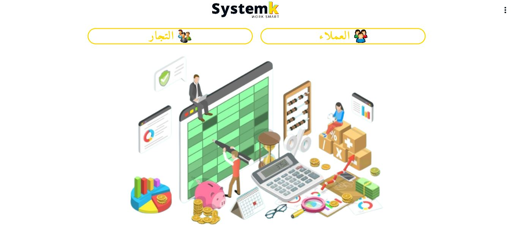
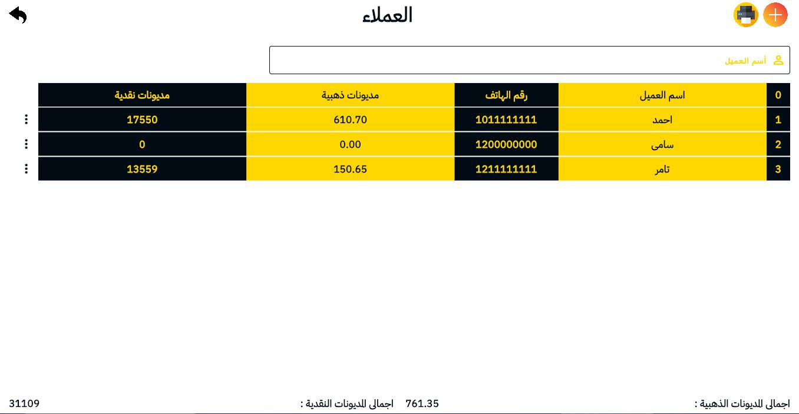
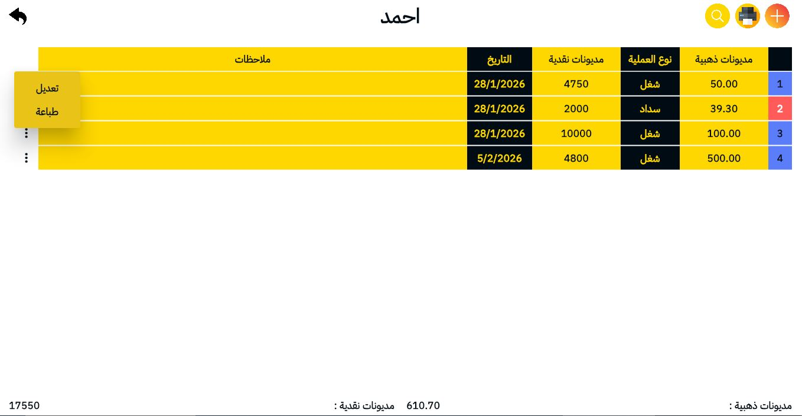
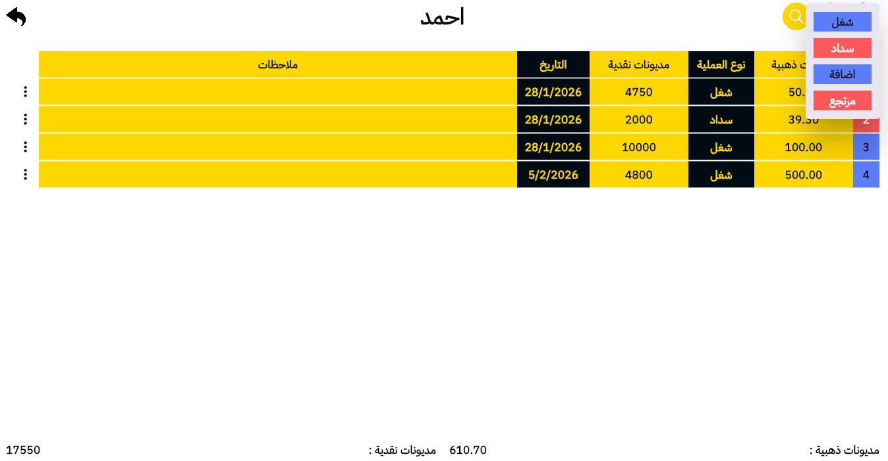
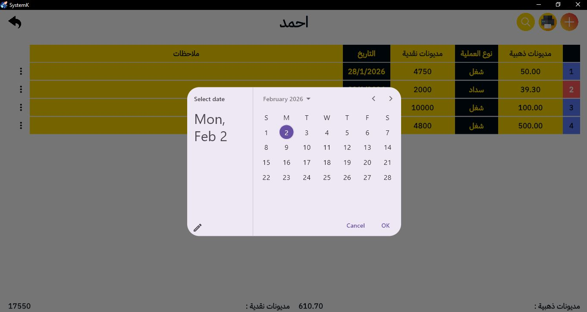
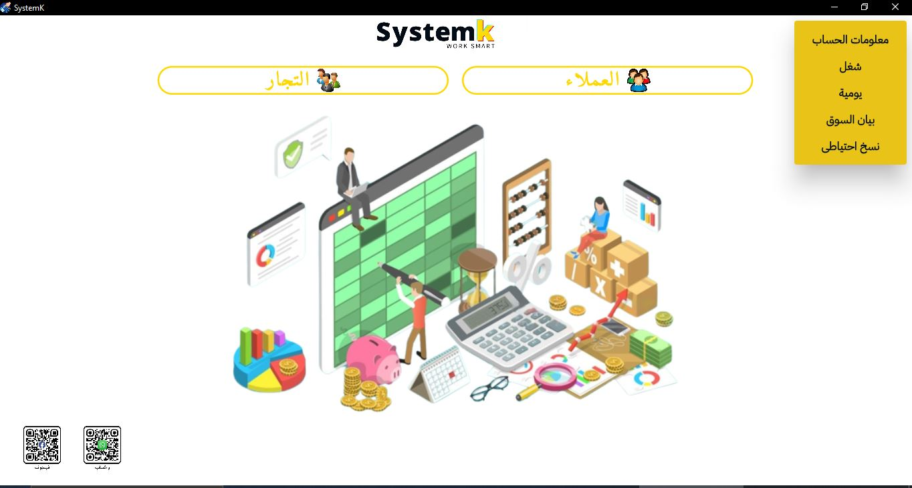
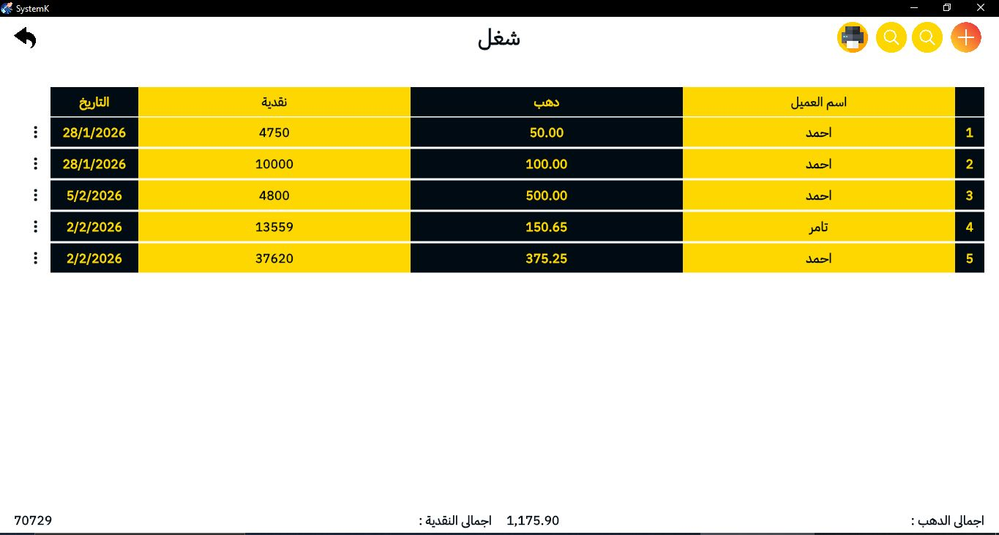
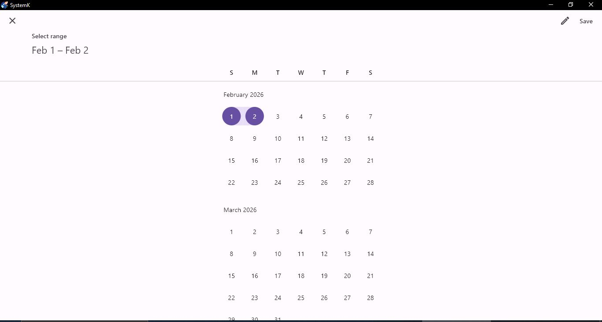
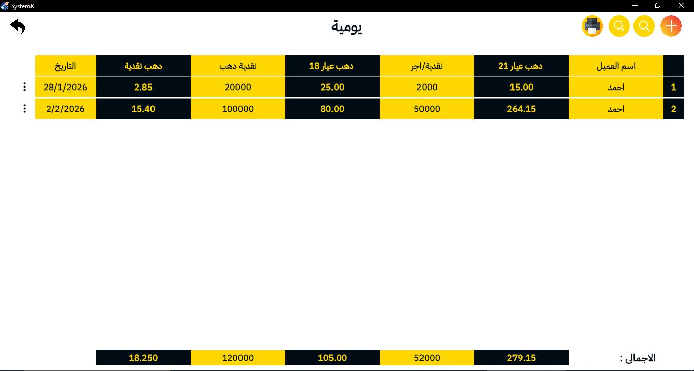

 # 💎 SystemK - Gold Shop Management System

A comprehensive desktop application built with Flutter for managing gold shop operations, digitizing traditional paper-based workflows.

## 📱 About The Project

SystemK transforms traditional paper ledgers used in gold shops into a modern digital management system. The application handles customer accounts, transactions (cash & gold), invoice generation, and business reporting - replacing manual record-keeping with an efficient, accurate digital solution.

### 🎥 App Screenshots

  
  
  
  
  
  
  
  
  
  
  

## ✨ Key Features

- 👥 **Customer Management**: Track unlimited customers with complete transaction history
- 💰 **Dual-Currency System**: Separate tracking for cash (EGP) and gold weight (grams) by karat
- 🧾 **Professional Invoicing**: Generate print-ready invoices with QR codes and company branding
- 📊 **Financial Reports**: Daily reports, market statements, and custom date-range analytics
- 🔍 **Smart Search**: Quick customer lookup and transaction filtering
- 🖨️ **Print System**: Direct printing for invoices and reports
- 🌐 **Bilingual Interface**: Full Arabic/English support with RTL layout
- 💾 **Offline-First**: All data stored locally with SQLite - no internet required

## 🛠️ Built With

- **Framework**: Flutter (Desktop - Windows)
- **Language**: Dart
- **Database**: SQLite (sqflite)
- **State Management**: Bloc Pattern
- **PDF Generation**: pdf package
- **Printing**: printing package

## 🏗️ Technical Implementation

### Core Features

**Transaction Types:**
- شغل (Work/Labor) - Add invoice
- سداد (Payment) - Record cash payments  
- إضافة (Addition) - Add transactions
- مرتجع (Return/Refund) - Handle return
**Multi-Karat Support:**
- Separate tracking for 18 karat and 21 karat gold
- Automatic weight calculations
- Balance updates per karat type

**Invoice System:**
- Itemized billing with quantities and prices
- Gold weight and karat specification per item
- Automatic total calculations
- PDF generation and print support

## 📊 Business Logic

The system manages complex financial calculations:
- Customer balances (cash + gold by karat)
- Transaction history and audit trails
- Real-time balance updates
- Date-based reporting and filtering

**Database Schema:**
- Customers table (accounts, balances)
- Transactions table (history, amounts)
- Invoices table (billing records)
- Invoice Items table (line items)

## 🎯 Problem Solved

**Before SystemK:**
- Manual paper ledgers prone to errors
- Difficult to search historical records
- No automatic calculations
- Risk of data loss
- Time-consuming report generation

**After SystemK:**
- Digital records with instant search
- Automatic balance calculations
- Professional invoices in seconds
- Secure data with backups
- One-click reporting

## 💼 Target Users

- Gold shop owners
- Jewelry store managers
- Gold traders
- Accounting staff in jewelry businesses

## 👨‍💻 Developer

**[Isaac Gerges]**
- GitHub: [@isaacGerges](https://github.com/IsaacGerges)
- LinkedIn: [isaacGerges](https://linkedin.com/in/isaac-gerges-14405022b/)

### Technical Skills Demonstrated
- Flutter Desktop Development
- SQLite Database Design & Optimization
- Bloc State Management
- PDF Generation & Printing Integration
- Complex Business Logic
- Financial Calculations & Reporting

## 📄 License

This is a proprietary project. The source code is private.

---

**Note:** This is a showcase repository demonstrating the application's features and technical implementation. The actual source code is kept private for business reasons.
